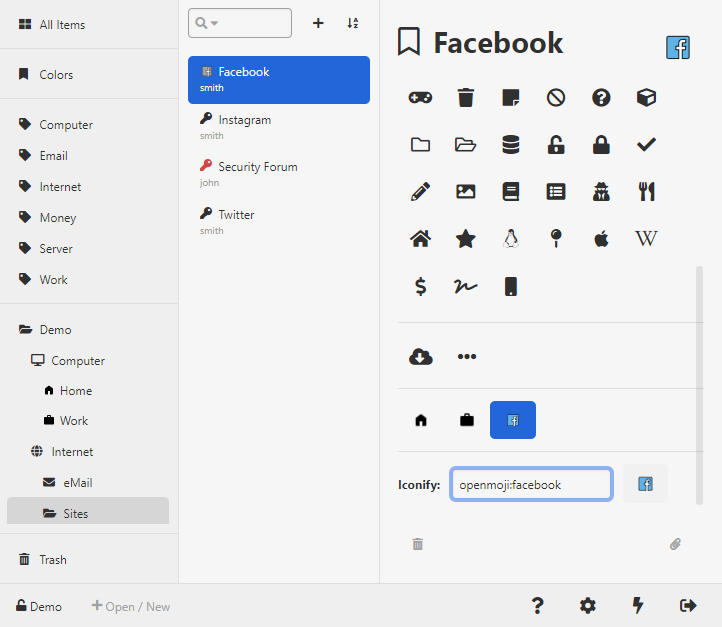

    

<h1 align="center">
Keeweb Plugin Iconify
</h1>

Set custom icon from Iconify

## Demo

    

## Query Iconify

- [Icônes](https://icones.netlify.app/)
- [Icon Sets • Iconify](https://icon-sets.iconify.design)
